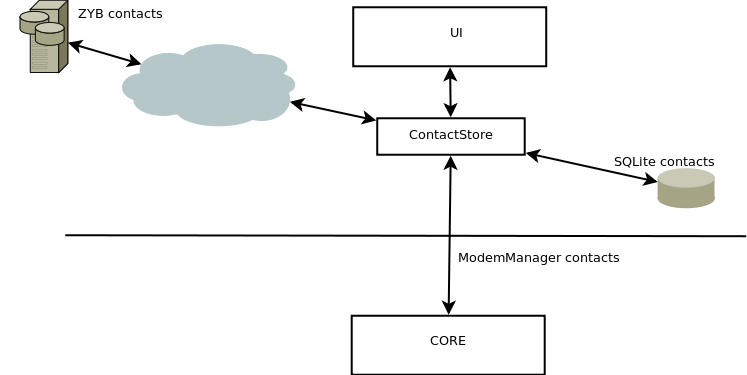
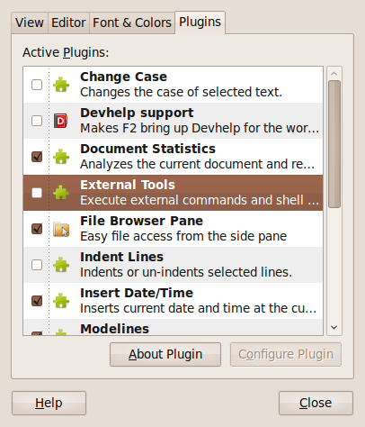

==========================
Pluggable contacts backend
==========================

Overview
========

During the BMC/Wader merge it became obvious that a pluggable contacts backend
was going to be required in order to support all the different contact sources
that `Vodafone`_ had in mind:

  * SIM contacts

  * Persistent contacts (SQL)

  * Web services contacts (`ZYB`_)

  * Desktop contacts (Evolution, KMail, etc.)

The design envisioned a central entity that would deal with all the different
plugins in a homogeneous way (ContactStore). Every plugin would provide its
own ``Contact`` class extending :class:`~wader.common.contact.Contact`.

.. _Vodafone: http://www.vodafone.com
.. _ZYB: http://www.zyb.com

Classes overview
================

:class:`~wader.common.contact.ContactStore` is is the central point to perform
operations with the different backends. It is a simple class that performs
operations on an array of different backends. Every operation will contact
every registered backend, and it is up to the backend to decide if it should
accept or ignore the given operation.

For example, a ``list_contacts`` operation will contact every backend and
will return an iterator that will yield all the contacts present in the
backend. On the other hand a specific operation, such as ``edit_contact``
will be ignored by all the backends but the one that the target belongs to.

How to determine that a contact object belongs to a given backend? Easy,
every backend must provide a :class:`~wader.common.contact.Contact` subclass
that will identify the contact type. When a foreign contact is received
in a backend for an specific operation, such as ``edit_contact`` the backend
will just ignore the request.

Design rationale
================

The design of this feature had to take into account that the core and UI run
separatedly in different processes. While the former runs as uid 0 (root),
the latter runs as a user process. Why is this important? Because one of the
first contact plugins developed was an SQLite backend. Any database created
at core level, could then be read by any user unless we complicated the
whole design and schema with user separation at the SQL level.

Instead we chose to instantiate the plugins at the GUI level, not only the
design was simpler, but also we had less data to worry at the core level.

The following diagram illustrates the design:

Not implemented
================

The following functionalities need some planning and discussion, thus
they are not present in the current implementation.

Plugin manager ala gedit
++++++++++++++++++++++++

Soon it became clear that a manager interface would be required so the user
can control what plugins are active at a given time, and also as a mean to
configure plugins that require some config.

Every row in the interface represents a plugin found in the system, they
can be enabled by ticking the checkbox next to it. In addition, there is
a configure button at the bottom of the interface, by clicking this button
a new interface specific to every plugin is shown. In the case of ZYB it
would contain widgets to be able to register online or enter an existing
username and password. Not all the plugins require a further screen to
configure them, right now ZYB is the only one.

Widgets to edit contacts
++++++++++++++++++++++++

There are certain backends, such as ZYB, that can handle way more data than
what other backends usually deal with (i.e. name, email and phone). ZYB can
configure middle name, family name, time zone, country, and more. Instead
of providing a base contact class with all this attributes, we chose to have
a simple contact class that is extended by subclasses with all this new
attributes. Similarly, every plugin module can provide widgets in a well
known location -i.e. ``plugin.widgets``- to edit this augmented contact
classes. ``plugin.widgets`` could well be a dictionary with the following
keys: add, config, edit, read. Every one of them has as its value a class
tailored for the situation that implements an interface for the task. When
needed, the class will be instantiated, used and then disposed.

