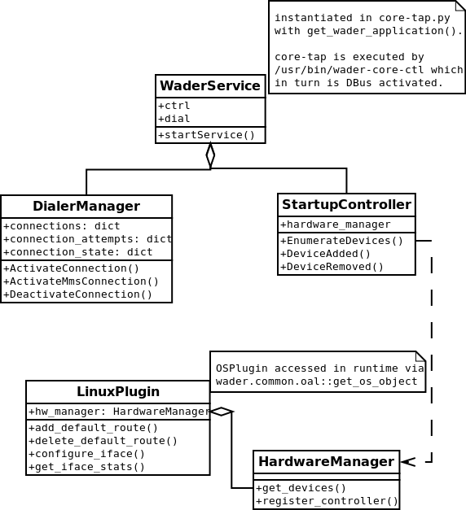
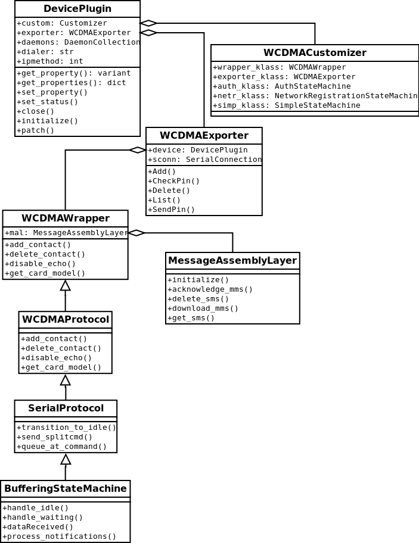

==============
Wader overview
==============

Introduction
============

Wader is a 3G device manager daemon written in Python and tested on Linux and
MacOS X (10.5 with recent `MacPorts`_).

Some of its features are:

- Pluggable architecture that can be extended by plugins
- Make mobile data connections over the network
- Manage your SIM contacts and SMS
- Operator-agnostic
- Implements the :term:`ModemManager` API. Thus writing a device plugin for Wader
  means that your device will work with the *de-facto* tool for managing
  networks
- Service actionable via :term:`DBus`

.. _MacPorts: http://www.macports.org/

History
=======

`Warp Networks`_ developed `Vodafone Mobile Connect Card driver for Linux`_
for `Vodafone Spain R&D`_ between late 2006 and early 2008.

When the project ended, we realized that there were some parts of the
application, like the core, that were pretty good and potentially useful for
other applications of the Linux/Unix desktop ecosystem that wanted to
interact with 3G devices.

So Warp decided to fork it, rewrite some dodgy spots and export all its juicy
bits over :term:`DBus`, which was the missing piece in order to be able to
talk with other applications of the Linux desktop. The project needed a new
name and we chose `Wader`_ for it.

.. _Warp Networks: http://www.warp.es/
.. _Vodafone Mobile Connect Card driver for Linux: http://www.betavine.net/web/linux_drivers/
.. _Vodafone Spain R&D: http://www.vodafone.es/
.. _Wader: http://www.wader-project.org/

Architecture
============

Wader solves a difficult problem, providing a common and pleasant API
able to deal with the differences of quirks of all the supported devices.

The approach has been developing abstraction layers in several parts
of the system in order to cope with this heterogeneity.

Wader service
#############

*wader-core* is usually started via DBus system activation. If it is
integrated with NetworkManager, NM will start it as part of its
startup. Otherwise, it'll be started by the bcm/wader-gtk binaries
when (initially) they request the `org.freedesktop.ModemManager` service.

This executes `/usr/bin/wader-core-ctl --start` which in turn executes
`/usr/bin/twistd` passing `/usr/share/wader-core/core-tap.py` as
argument. twistd is the application launcher provided by the Twisted
framework.

`core-tap.py` instantiates (singleton) `WaderService` via
`get_wader_application()`.

:class:`wader.common.startup.WaderService` is a just a container for
two other main classes:

 * :class:`wader.common.startup.StartupController`: Responsible for
   device management, it integrates with the underlying `OSPlugin`'s
   `HardwareManager` firing DBus signals when a 3G device is
   removed/added and maintaining a list with the devices available
   in the system. Internally, this devices use the `DevicePlugin` class.

 * :class:`wader.common.dialer.DialerManager`: Responsible for
   connection management, it integrates with the underlying backend in
   use, using its `ProfileManager` and the `Dialer` that the backend
   specifies.

BufferingStateMachine, SerialProtocol, WCDMAProtocol and WCDMAExporter
######################################################################

Collection of classes that deal with the serial communication, AT commands
and exporting it via DBus:

 * :class:`wader.common.protocol.BufferingStateMachine`: Simple state
   machine with two states: `idle` (when you are not doing anything)
   and `busy` (when waiting for a command response). It processes
   (un)solited notifications during `handle_idle` and will emit
   signals if the device has registered a callback for the given signal.

 * :class:`wader.common.protocol.SerialProtocol`: Extends
   `BufferingStateMachine` and provides some methods to deal with AT
   commands asynchronously.

 * :class:`wader.common.protocol.WCDMAProtocol`: Extends `SerialProtocol`
   and provides the low-level implementation of all the AT commands.
   Commands have a regexp that is able to parse them, this class
   method's return list of regexp matches to the upper layer.

 * :class:`wader.common.middleware.WCDMAWrapper`: Extends `WCDMAProtocol`
   and provides the high-level implementation of most AT commands. It
   extracts the matched text from the lower layer and converts it to
   the appropriated type/object. (i.e. `get_sms` might raise `CMSError314`
   (NotFound) which is translated as an empty list). If the method
   returns a single element, it won't return it as a list/sequence. Also
   if a method requires a retry, it will be implemented here.

 * :class:`wader.common.exported.WCDMAExporter`: It exports over DBus
   all the `WCDMAWrapper` methods.

DevicePlugin
############

Contains all the information and methods related to a given device in the
system. Due to the heterogeneity of the supported devices, we needed
several points of customization for every device. Wader has layers and
layers of software that abstract as much as possible this differences.

A DevicePlugin contains a `WCDMACustomizer` object with the following
attributes:

 * `wrapper_klass`: Subclass of :class:`wader.common.middleware.WCDMAWrapper`.
   Used if a device requires a workaround for a particular operation (i.e.
   switching to `GSM` from `UCS2` before a particular operation.)

 * `exporter_klass`: Subclass of :class:`wader.common.exported.WCDMAExporter`.
   Used if a device requires exporting more methods/signals over DBus (i.e.
   :class:`wader.common.exported.HSOExporter`.

 * `auth_klass`: Subclass of :class:`wader.common.statem.auth.AuthStateMachine`.
   Used if a device has special needs for its initial authentication.

 * `netr_klass`: Subclass of :class:`wader.common.statem.networkreg.NetworkRegistrationStateMachine`.
   Used if a device has special needs for registering with the network.

 * `simp_klass`: Subclass of :class:`wader.common.statem.simple.SimpleStateMachine`.
   Used if a device has special needs for its SimpleStateMachine. This class is
   used when the integration with NM is on.

OSPlugin
########

Yet another layer of abstraction, it provides a uniform layer to perform
OS-dependent operations. Every `OSPlugin` has a `HardwareManager` that ends
up integrated in :class:`wader.common.startup.StartupController` so it can
interact with the devices in the system. It is accessed via
:func:`wader.common.oal.get_os_object` in runtime.

Backends
########

Yet another layer of abstraction, in order to integrate with third party
connection managers (such as NetworkManager), we needed a mean to abstract
the differences between systems.

The backend is accesed via :func:`wader.common.backends.get_backend`.

The backend contains a `ProfileManager`, a `KeyringManager` and a `Dialer`
that will be used in runtime once the system is started.
