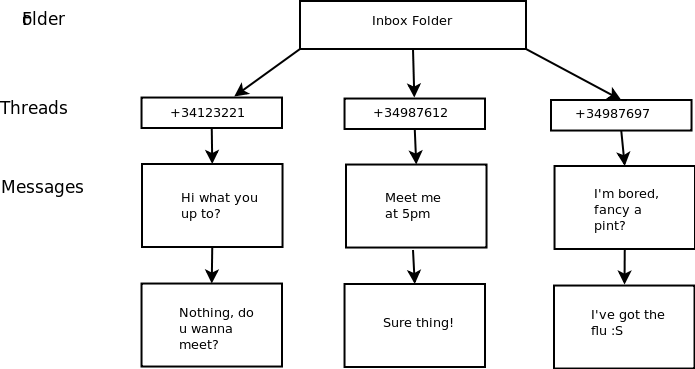

===============
SMS persistence
===============

Overview
========

One of the goals of the BMC/wader merge was to create a contacts and SMS
persistence layer to store data on a medium with better characteristics
than a plain SIM. `SQLite`_ was chosen because of its small footprint,
the fact that has been included with Python since 2.5 and that it was
already used in other parts of the system.

.. _SQLite: http://www.sqlite.org/

SMS classes overview
====================

A :class:`~wader.common.provider.Message` is always part of a
:class:`~wader.common.provider.Thread`, and a thread always belongs to
a :class:`~wader.common.provider.Folder`. The central point to perform
operations on this three classes is the
:class:`~wader.common.provider.SmsProvider`.

Every conversation with your contacts is stored in a `Thread`. There can
only be one thread for a number in a given folder, if a `Message` is
moved to a folder and no thread exists for that number it will be
automatically created and the message will be associated to it.

Similarly, if a `Message` is moved to a `Folder` and a `Thread` already
exists for the message's number, it will be associated to it.

There are three folders by default: Inbox, Outbox and Drafts. This three
folders can not be deleted by design. The user can add as many folders as
she desires, but those initial three shall not be deleted.

.. _CRUD: http://en.wikipedia.org/wiki/Create,_read,_update_and_delete

