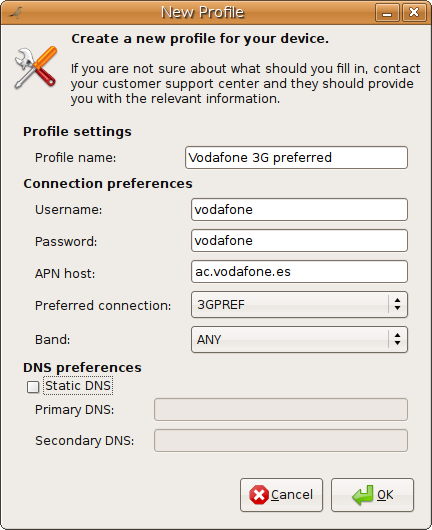
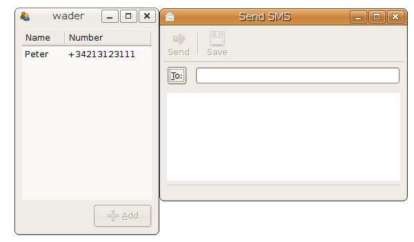
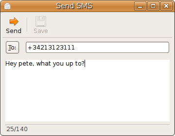
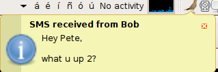
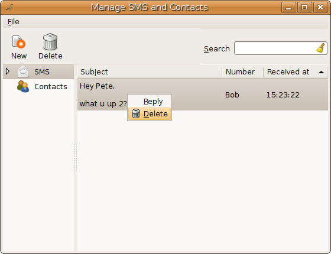
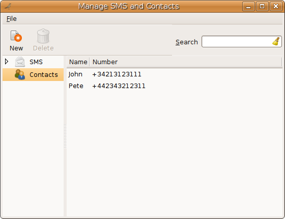
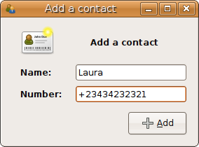
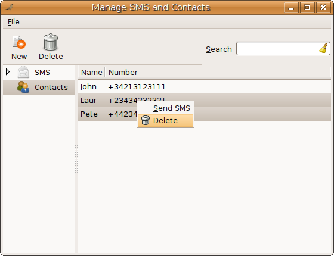
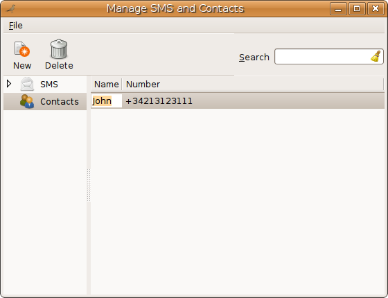
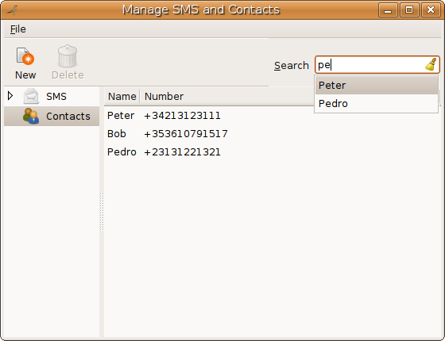

==============
Wader tutorial
==============

:Author: Pablo Martí
:Date: 2009/01/14
:Version: 1.0

Introduction
============

What is Wader?
--------------

Wader_ provides a DBus interface to manage mobile broadband devices. It
implements a loadable plugin architecture to add workarounds for non-standard
cards. Wader is the first project, apart from :term:`ModemManager` itself,
that implements the :term:`ModemManager` API making it an excellent choice to
base your application on.

.. _Wader: http://www.wader-project.org

Wader history
-------------

Wader started off as a fork of `Vodafone Mobile Connect Card driver for
Linux`_ (you might know this application from our previous `how to`_). Wader
took its most juicy bits and exports them over DBus. Wader 0.1 and 0.2.X
releases were funded by Elonex_ and orchestrated by the `The Open Learning
Centre`_. Wader provided dialup capabilities on the Webbook_ for some of the
main mobile broadband providers in the UK: Orange, T-Mobile, O2 and 3.

The 0.3.X series have been entirely funded by `Warp Networks`_.

.. _Vodafone Mobile Connect Card driver for Linux: http://forge.vodafonebetavine.net/projects/vodafonemobilec
.. _how to: http://www.howtoforge.com/vodafone_mobile_connect_card_driver_linux
.. _Elonex: http://www.elonex.co.uk
.. _The Open Learning Centre: http://www.theopenlearningcentre.com
.. _Webbook: http://www.theopensourcerer.com/2008/07/24/say-hello
.. _Warp Networks: http://www.warp.es

Wader features
--------------

- Easy to use UI in GTK+ decoupled from core

  * Brandeable (OEMs)

- Data call handling (Connect/Disconnect from Internet)
- Manage your SMS and Contacts
- Send and receive multiparted SMS
- Handle your contacts from several sources with the contact backends
- Profile management
- Usage statistics with a configurable threshold
- Preliminary multiplatform support (Linux, OSX...)
- Extendable architecture via plugins, just drop a plugin in a well known location and:

  * Add support for a new device
  * Add support for a new OS/distro
  * Add support for a new contact source (ModemManager, SQLite and `ZYB`_ implemented)

- Dialup on heterogeneous environments:

  * No NetworkManager or NetworkManager <= 0.6.X (via wvdial)
  * NetworkManager 0.7.X  (via NetworkManager itself)

- Implements 100% of the ModemManager API

.. _ZYB: http://zyb.com/

How does Wader stack against its competitors
--------------------------------------------

One of the main advantages of using free software is the overwhelming amount
of choice that users have. The field of mobile broadband is not by any means
different. We hope that the following table will help you to make an informed
choice whether you are a prospective user, developer or OEM representative.

+---------------------+----------------+----------------+--------------------+
| Feature             |   NM0.7+       |   VMC2         |   Wader 0.3.6      |
+---------------------+----------------+----------------+--------------------+
| Multiplatform       |   No           |   No           |   Yes (Linux, OSX) |
+---------------------+----------------+----------------+--------------------+
| Extendable arch.    |   Yes (C/Glib) |   Yes (Python) |   Yes (Python)     |
| via plugins         |                |                |                    |
+---------------------+----------------+----------------+--------------------+
| Default branding    |   No           |   Yes (VF)     |   No               |
+---------------------+----------------+----------------+--------------------+
| Brandeable UI       |   No           |   No           |   Yes              |
+---------------------+----------------+----------------+--------------------+
| SMS/Contacts        |   No           |   Yes          |   Yes              |
| support             |                |                |                    |
+---------------------+----------------+----------------+--------------------+
| Graphic Toolkit     |   Yes          |   No           |   Yes              |
| Agnostic            |                |                |                    |
+---------------------+----------------+----------------+--------------------+
| UI decoupled        |   Yes          |   No           |   Yes              |
| from core           |                |                |                    |
+---------------------+----------------+----------------+--------------------+
| Desktop integration |   N/A          |   No           |   Yes              |
| with NM             |                |                |                    |
+---------------------+----------------+----------------+--------------------+

Supported devices
-----------------

Wader has been thoroughly tested on the following devices:

 * Ericsson: MD300
 * Huawei: E169, E170, E172, E220, E270, E272, E620, E870, EM730V, K3520
 * Novatel: MC950D
 * Option: Nozomi, Etna, Icon 225, Icon 401, K3760

In addition, the community contributed the following plugins:

 * Dell: D5520, D5530
 * Ericsson: F3507g
 * Huawei: B970, E3735, E510, E660, E660aA, EM770, K2540, K3565, K3715
 * Novatel: U630, U740, EU740, XU870, MC990D, MiFi2352, S720, XU870
 * Onda: MSA405HS
 * Option: Colt [1]_ , GlobeSurfer Icon, GT Fusion, GT Fusion Quad Lite,
   GT M 378, GT Max 3.6, E3730
 * SierraWireless: 850, 875, MC8755
 * ZTE: MF620, MF632, K2525, K3520, K3565, K3765, K4505

Installing Wader
================

Wader 0.3.6 includes support for Ubuntu, OpenSUSE and Fedora by default.

Installing Wader on Ubuntu
--------------------------

If you want to add the Wader PPA to your :file:`/etc/apt/sources.list`
append the following lines at the end of it::

       deb http://ppa.launchpad.net/wader/ubuntu jaunty main
       deb-src http://ppa.launchpad.net/wader/ubuntu jaunty main

Now run::

       sudo apt-get update
       sudo apt-get install wader-gtk

Installing Wader on OpenSUSE
----------------------------

On OpenSUSE, installing Wader is really easy thanks to their "1-click"
install infrastructure. It is recommended to upgrade OpenSUSE 11.1 before
installing Wader, as Wader depends on a more recent version of
``NetworkManager-gnome`` for running.

We'll need to manually delete first a conflicting file::

    sudo rpm -e --nodeps ModemManager

To install Wader `on OpenSUSE 11.1+ click
here <http://software.opensuse.org/ymp/home:pablomarti/openSUSE_11.1/wader-gtk.ymp>`_.

In order to use Wader, your user must be member of the ``uucp`` group::

    sudo /usr/sbin/usermod username -G uucp

And reboot the machine::

    sudo reboot

Installing Wader on Fedora 10
------------------------------

To install Wader on Fedora 10, run as root::

    wget http://download.opensuse.org/repositories/home:/pablomarti/Fedora_10/home:pablomarti.repo \
        -O /etc/yum.repos.d/home:pablomarti.repo
    yum update
    yum install wader-gtk

In order to use Wader, your user must be member of the ``uucp`` group::

    sudo /usr/sbin/usermod username -G uucp

and you will also need to disable SELinux while we write a SELinux policy for
Wader. To do so, go to
:menuselection:`System --> Administration --> SELinux Management` and set the
`System Default Enforcing Mode` to Disabled. Check the `Relabel on next
reboot` and reboot the machine::

    sudo reboot

Getting started
===============

To start the application, go to :menuselection:`Applications --> Internet`
and launch "Mobile Broadband" from there. Alternatively, you can also start
the application from the console with::

    wader-gtk

Initial device configuration
----------------------------

Once you device is detected its authentication status will be checked and
you may need to enter your PIN number if its enabled.

.. image:: images/pin-required.png
    :alt: Ask PIN dialog
    :align: center

Once the authentication is completed, the device will be initialized and
you will be presented with a window to create a connection profile. In Wader,
you need a connection profile if you want to connect to the Internet.

Wader itself comes with a small database with tested settings contributed by
users. If your operator happens to be present in that database, you will
only need to select a connection mode (and optionally) a band mode. If your
operator is not present in the database, the profile creation window will
be empty and you will need to fill in the relevant details. If you have
doubts about what you should fill in, you can contact your customer support
service and they will provide you the details.

Connecting to Internet
----------------------

Once you have an active connection profile, you are set to connect to Internet.
You just need to press the big "Connect" button in the main window. A small
popup window will appear showing the progress of the connection. Once its
established, the popup will disappear and the big button will read
"Disconnect".

Press it again and you will be disconnected from Internet.

Messages
--------

Wader provides a CRUD [2]_ interface for managing your SMS. Click on
:menuselection:`View -> Manage SMS/Contacts` to show its window. By default,
it starts on SMS mode.

Sending a SMS
~~~~~~~~~~~~~

Start by clicking on the "New" button or by pressing "Ctrl+N". In the bottom
entry you will type the text to send, and in the middle one the destination
numbers. There is a "To" button to the left of the contacts entry and by
clicking it you will be presented with a list showing all the contacts in
the SIM card. Double-clicking on a contact will add it to the list of
recipients unless is already there. You can of course directly type a number.

When you start typing the text, a status bar in the bottom will show you
the number of characters left. There are two main SMS encodings: 7-bit and
UCS2. While the former allows to send texts of up to 140 characters, with
the latter is only 70 characters.

Once your text is ready, you just need to press the "Send" button.

Receiving SMS
~~~~~~~~~~~~~

When a SMS is received, a notification window will be shown displaying the
sender's name (if known), and the SMS text.

Deleting SMS
~~~~~~~~~~~~

Deleting a SMS its as easy as selecting it from the list and clicking on
the delete button. Alternatively you can press the "Del" key or right
clicking on a selection and selecting "Delete" from the popup menu.

Contacts
--------

Wader provides a CRUD [2]_ interface for managing your contacts. Once you
have started the application, click on the contacts row in the left treeview
to switch to contacts mode.

Adding a contact
~~~~~~~~~~~~~~~~

New contacts can be added by clicking on the "New" button or pressing
"Ctrl + N" while in contacts mode. You just need to provide a name, a valid
number and press the "Add" button.

Deleting a contact
~~~~~~~~~~~~~~~~~~

Contacts can be deleted by clicking on the "Delete" button or pressing the
"Del" key while in contacts mode. You can also select an arbitrary number
of contacts, right click in the selection and clicking on "Delete".

Editing a contact
~~~~~~~~~~~~~~~~~

Any contact details can be changed by clicking on its row and directly
start editing its name or number. Once you are done, press "Enter" and that
is it.

Search for contact name
~~~~~~~~~~~~~~~~~~~~~~~

You can search for contacts using the search entry in the top left
corner of the contacts application. It will provide suggestions for
what you are typing if it matches with any contact name.

Troubleshooting
---------------

When something goes wrong or does not work, you might have found a bug in
Wader. There are two main log files that will yield clues about what went
wrong:

/var/log/wader.log
  This is wader-core log file and if an AT command has failed, or an
  exception has occurred while executing a core process -i.e. network
  registration- it will be reflected here. A quick way to access this
  file is clicking on "View -> Log".

/tmp/wader-gtk-username.log
  This is wader-gtk log file and if a GUI-related operation has failed,
  it will be shown here.

Armed with this information, you can contact the developers by:

Asking a question in the `Wader forums <http://forums.wader-project.org>`_.
  Perhaps your question was already answered here, or perhaps is a new
  bug. Either way feel free to contact us with whatever bug, suggestion or
  crazy idea you might have about Wader.

Sending a mail to the `devel list <https://lists.warp.es/mailman/listinfo/wader-devel>`_:
  This is a developer-oriented list, and depending on the question it might
  be more appropriate to ask it in the forums. If you want to add a new
  device, OS/distro, or a new feature to Wader, we will happily answer
  any question you might have.

.. [1] It has a rather buggy firmware, disable PIN authentication
.. [2] `CRUD <http://en.wikipedia.org/wiki/Create,_read,_update_and_delete>`_.

